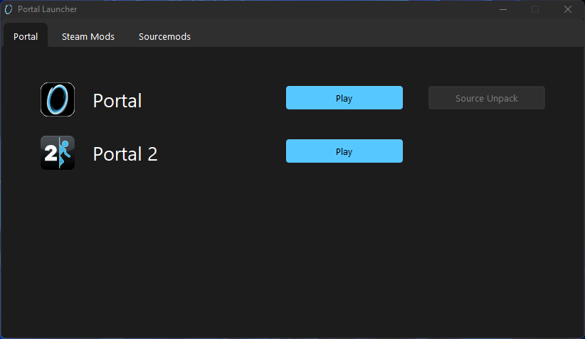

    
# Portal Launcher

I am a huge fan of the portal franchise and lots of its mods. And i play a lot of them. And recently i thought that i dont want all of those icons on my desktop, and a program to acces all of them would be way cooler. So i made it, and i upload it here for other portal fans to use it!
    
**It has been reported that the latest beta doesnt work on windows 10, so the app is windows-11-only until i find a fix**

## Warning!:

The app is currently in Beta phase ans so many features are still missing! But it is usable though

## Features:

Currently the app can only launch the official portal games and mods that are available on steam (rexaura and aperture tag are not yet added). It can also detect and launch sourcemods.
